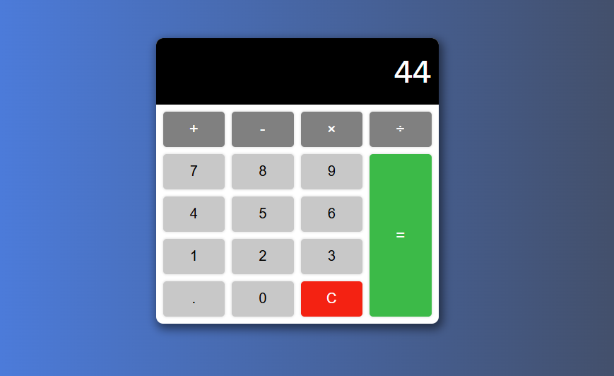

# Calculator

This project is a fully functional calculator built using **vanilla JavaScript**, **HTML**, and **CSS** only
## Features
- Supports **addition, subtraction, multiplication, and division**
- Handles **decimal numbers**
- “Clear” button to reset calculations
- Responsive layout for desktop and mobile
- Clean, minimal design

## Preview
[demo](https://abdo-rabea.github.io/calculator/)

## What You’ll Learn
- DOM selection and event handling
- Handling numeric and operator inputs
- Implementing calculation logic using functions
- Preventing invalid decimal input
- Managing calculator state (`currentNumber`, `result`, `operator`)
- Updating the display dynamically
## Tech Stack
- **HTML5**
- **CSS3**
- **JavaScript (ES6+)**
